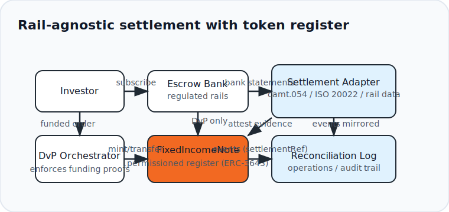
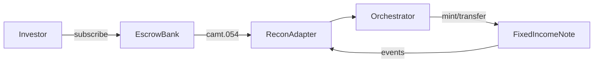

# KBB_MVP — Token-registered private debt, cash-settled on regulated rails

[](https://github.com/duracell04/KBB_MVP/actions/workflows/ci.yml)
[](#license)
[](https://duracell04.github.io/KBB_MVP/)
[](https://book.getfoundry.sh/)

**Keywords:** tokenized securities, private debt, DvP, ISO 20022, [ERC-3643](https://docs.erc3643.org/erc-3643), reconciliation, settlement evidence, regulated rails.

> **Design principle:** Cash settles on regulated rails; the token is the register & distribution layer. Permissioning, eligibility, and lifecycle evidence stay in sync via deterministic identifiers across on-chain events and off-chain banking proofs.

---

## Table of Contents
- [TL;DR](#tldr)
- [Architecture](#architecture)
- [Event Schema](#event-schema)
- [Repo Map](#repo-map)
- [Quickstart](#quickstart)
- [Economics Snapshot](#economics-snapshot)
- [Documentation](#documentation)
- [Troubleshooting](#troubleshooting)
- [Glossary](#glossary)
- [Security & Compliance](#security--compliance)
- [Contributing](#contributing)
- [License](#license)

## TL;DR
- **Instrument:** `FixedIncomeNote` — ERC-20-like supply where each unit represents one currency unit of face value; transfers are permissioned via ERC-3643-compatible eligibility checks.
- **Issuance:** Delivery-versus-Payment (DvP) only; mint/transfer occurs after verified settlement evidence with deterministic references.
- **Servicing:** Coupons/redemptions wire off-chain; on-chain events carry `settlementRef`/`settlementNetwork` for deterministic reconciliation against escrow statements.

## Architecture

<p align="center">
  
</p>

<details>
<summary>Mermaid (source)</summary>



</details>

**Core flows**

- **Primary (DvP):** Investor funds on a supported rail → adapter attests → orchestrator mints/transfers → `SubscriptionSettled(...)` includes banking reference identifiers.
- **Servicing:** Escrow wires coupons/redemptions off-chain → token emits `CouponPaid(...)` / `RedemptionPaid(...)` with the same deterministic references so operations can reconcile without heuristics.

## Event Schema

```solidity
event SubscriptionSettled(
  bytes32 orderId,
  address investor,
  uint256 amount,
  string  currency,
  string  settlementRef,
  string  settlementNetwork // e.g. ISO20022 | SWIFT | SEPA | ACH | FPS | ONCHAIN_STABLECOIN
);

event CouponPaid(
  uint256 periodId,
  uint256 grossAmount,
  uint256 withholding,
  uint256 netAmount,
  string  settlementRef,
  string  settlementNetwork
);

event RedemptionPaid(
  uint256 amount,
  string  settlementRef,
  string  settlementNetwork
);
```

**Example (ISO 20022 / UETR):**

```json
{
  "event": "SubscriptionSettled",
  "orderId": "0xabc…",
  "amount": "100000000",
  "currency": "EUR",
  "settlementRef": "1f9c20d4-4c1e-11ef-9a9a-0242ac120002",
  "settlementNetwork": "ISO20022"
}
```

## Repo Map

| Path | Description |
| --- | --- |
| [`contracts/`](contracts) | Solidity contracts (`FixedIncomeNote`, math utilities, ERC-3643 compatibility hooks). |
| [`ops/`](ops) | DvP/reconciliation simulators, validators, and adapters (TypeScript & Python). |
| [`apps/frontend/`](apps/frontend) | Placeholder frontend workspace for future dashboards. |
| [`assets/`](assets) | Diagrams and exported artifacts for documentation. |
| [`docs/`](docs) | MkDocs site content, specs, ADRs, and runbooks. |
| [`market/`](market) | Sample economics JSON plus JSON Schema for validation. |
| [`scripts/`](scripts) | Shell helpers for demos and validation. |
| [`test/`](test) | Foundry-based contract tests. |
| [`VISION.md`](VISION.md) | Long-term vision (link referenced in README). |
| [`ROADMAP.md`](ROADMAP.md) | Iteration plan and milestones. |

## Quickstart

> Requires [Foundry](https://book.getfoundry.sh/) and Node.js 20 (matching CI). CI runs the same steps.

```bash
forge build && forge test -vv
npm ci
npm run demo:all
```

Secrets/configuration for local ops scripts live in `.env`; see [`.env.example`](.env.example) for the expected keys. Do not commit production credentials — use environment variables in CI/CD runners.

See [docs/quickstart.md](docs/quickstart.md) for artifact locations and troubleshooting tips.

## Economics Snapshot

The economics TL;DR lives in [`market/economics.sample.json`](market/economics.sample.json) and validates against [`market/economics.schema.json`](market/economics.schema.json). Feed the JSON to your frontend for a card/table or render directly in docs.

## Documentation

| Topic | Link |
| --- | --- |
| Overview landing page | [docs/index.md](docs/index.md) |
| System & DvP architecture | [docs/architecture.md](docs/architecture.md) |
| Lifecycle events & schemas | [docs/events.md](docs/events.md) |
| Reconciliation | [docs/recon.md](docs/recon.md) |
| Financial mechanics | [docs/financial-mechanics.md](docs/financial-mechanics.md) |
| Contracts | [docs/contracts.md](docs/contracts.md) |
| Compliance preview | [docs/compliance.md](docs/compliance.md) |
| Settlement adapters | [docs/adapters.md](docs/adapters.md) |
| Eligibility registry | [docs/eligibility.md](docs/eligibility.md) |
| Runbooks | [docs/runbooks](docs/runbooks) |
| ADRs | [docs/adr](docs/adr) |

The full documentation site builds with MkDocs Material and publishes to GitHub Pages on every merge to `main`.

## Troubleshooting

- `forge` cannot find `solc`: run `foundryup` to install the pinned toolchain.
- `npm run demo:all` fails with TypeScript errors: ensure Node 20 and npm 10; reinstall with `npm ci`.
- Event validation errors: regenerate fixtures with `npm run demo` to refresh `out/events.sample.json`.
- Mermaid not rendering in your viewer? Open the exported diagram in [`assets/diagrams/system.svg`](assets/diagrams/system.svg).

## Glossary

- **DvP (Delivery-versus-Payment):** Settlement pattern where asset delivery occurs only when payment is confirmed.
- **MsgId / UETR:** ISO 20022 identifiers for payment messages; used as deterministic `settlementRef` values.
- **ONCHAIN_STABLECOIN:** Settlement network identifier for on-chain stablecoin rails (whitelisted issuers only).
- **Settlement Adapter:** Off-chain component that ingests bank statements and attests settlement evidence on-chain.
- **FixedIncomeNote:** ERC-3643-compatible ERC-20-like contract representing the debt register.

## Security & Compliance

The permission boundary follows [ERC-3643](https://docs.erc3643.org/erc-3643): eligibility, lockups, and jurisdiction checks enforce who can hold or transfer the note. Cash remains off-chain at regulated institutions, while tokens capture the register plus machine-readable audit events.

Reference [VISION.md](VISION.md) and [ROADMAP.md](ROADMAP.md) for the long-term direction and upcoming milestones.

## Contributing

Small, focused PRs please ✨

- **Workflow:** Fork → small branch → PR to `main` with descriptive commit messages (use imperative mood, e.g., `feat: add coupon rounding test`).
- **Expectations:** Include tests for math/permissions where applicable and update docs & schemas when event shapes change.
- **Checklist (include in PR description):**
  - [ ] `forge test -vv`
  - [ ] `npm run demo` (regenerates `out/events.sample.json`)
  - [ ] `npm run validate:events`
  - [ ] Invariants & rounding behavior covered by tests (if logic touched)
- **Security:** Use private disclosure per `.github/SECURITY.md`. Do not open public issues for security bugs.
- **License:** Contributions land under the MIT license unless noted otherwise.

See [CONTRIBUTING.md](CONTRIBUTING.md) for triage details, style notes, and the commit message template.

## License

MIT. See [LICENSE](LICENSE). Informational only; not an offer to sell or solicitation to buy any security.
