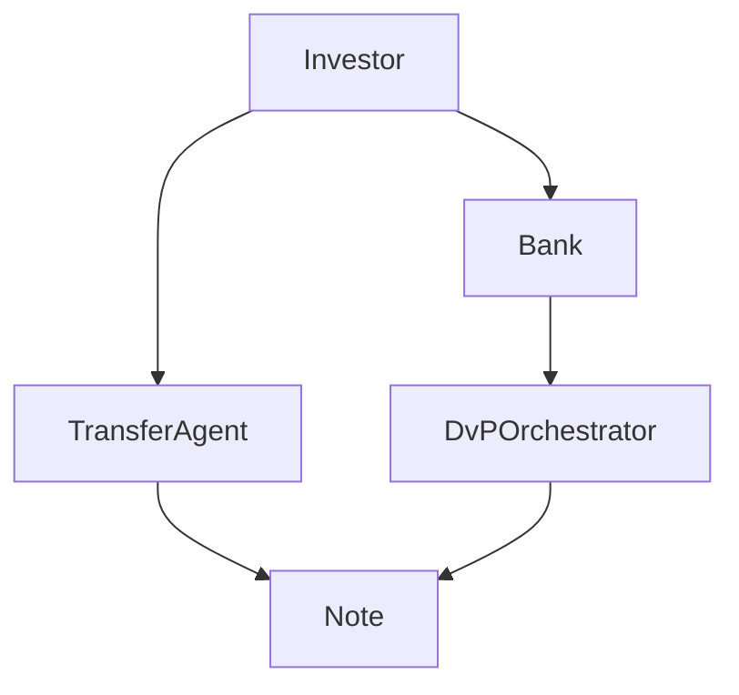

# Architecture Overview

The KBB MVP issues a single ERC-3643 compatible fixed-income note. Investors subscribe via a delivery-versus-payment workflow that coordinates bank settlement with on-chain transfers.

1. Investors submit subscription requests to the DvP orchestrator.
2. Transfer agents validate KYC/AML requirements via the identity registry.
3. Upon confirmed bank settlement, the orchestrator triggers on-chain issuance.
